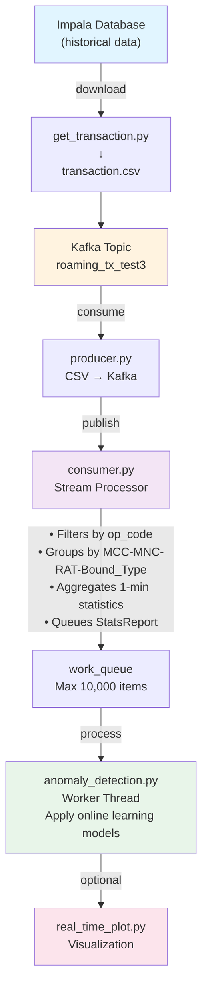

# Time-Series Anomaly Detection for Roaming Transactions

A real-time anomaly detection system for monitoring cellular roaming transactions using Apache Kafka and online learning algorithms.

## Project Overview

This system processes transaction streams from multiple cellular operators, aggregating statistics by operator (MCC), network code (MNC), radio access technology (RAT), and traffic direction (bound type). It detects anomalies in transaction success rates using online learning models that require no historical data storage.

**Key Features:**
- Real-time Kafka-based transaction streaming
- Stateful aggregation into configurable time buckets (default: 1 minute)
- Online anomaly detection using River library
- Multi-dimensional grouping (MCC-MNC-RAT-Bound_Type)
- Thread-safe async architecture with separate consumer and detection workers
- Support for Impala database integration for historical data

## Architecture



**Components:**

- **producer.py** - Reads transaction CSV, publishes to Kafka with operator-based partitioning
- **consumer.py** - Subscribes to Kafka topic, filters and groups transactions, manages stats state
- **stream_state_processor.py** - `StatsReport` class for tracking transaction statistics
- **anomaly_detection.py** - Worker thread processing statistics with online learning models
- **real_time_plot.py** - Matplotlib-based real-time visualization (optional)
- **get_transaction.py** - Impala database query script to fetch historical transactions

## Installation

### 1. Create Virtual Environment

```bash
python -m venv .venv

# Activate
# Windows:
.\.venv\Scripts\Activate.ps1

# macOS/Linux:
source .venv/bin/activate
```

### 2. Install Dependencies

```bash
pip install -e .
```

Or manually:
```bash
pip install pandas>=2.3.3 numpy>=2.4.4 river>=0.23.0 confluent-kafka statsmodels>=0.14.6 impyla>=0.22.0 tqdm>=4.67.3 mlflow>=3.10.1 websockets>=16.0
```

### 3. Set Up Kafka

```bash
# Using Docker (recommended):
docker-compose up -d kafka zookeeper

# Or create topic manually:
kafka-topics.sh --create \
    --topic roaming_tx_test3 \
    --bootstrap-server localhost:9092 \
    --partitions 4 \
    --replication-factor 1
```

## Configuration

### Kafka Producer Config

[producer.py](producer.py#L12-L18)

```python
PRODUCER_CONFIG = {
    'bootstrap.servers': 'localhost:9092',      # Kafka broker
    'client.id': socket.gethostname(),
    'acks': 'all',                              # Wait for all replicas
    'linger.ms': 10,                            # Batch delay
    'compression.type': 'snappy',
}

TOPIC = 'roaming_tx_test3'
```

### Kafka Consumer Config

[consumer.py](consumer.py#L11-L16)

```python
CONSUMER_CONFIG = {
    'bootstrap.servers': 'localhost:9092',
    'group.id': 'roaming-monitor-group',
    'auto.offset.reset': 'earliest',
    'enable.auto.commit': False,
}

TOPIC = 'roaming_tx_test3'
```

### Database Config

[get_transaction.py](get_transaction.py#L7-L13)

```python
conn = connect(
    host='10.168.49.12',
    port=21050,
    database='roam352_report_digi',
    user='unified',
    password='unified'
)
```

### Anomaly Detection Parameters

[anomaly_detection.py](src/worker/anomaly_detection.py#L17-L33) (commented template)

```python
period = 288                    # Seasonality period (hourly → 288 data points/day)
n_std = 3.5                     # Anomaly threshold (standard deviations)
warmup_period = 15              # Minimum observations before detection enabled
```

## Project Structure

```
ts_anomaly_detection_test/
├── README.md
├── pyproject.toml              # Dependencies and project config
│
├── producer.py                 # CSV → Kafka
├── consumer.py                 # Kafka → Stats aggregation
├── get_transaction.py          # Impala → CSV
│
├── src/
│   ├── processor/
│   │   ├── __init__.py
│   │   └── stream_state_processor.py    # StatsReport class
│   ├── worker/
│   │   ├── __init__.py
│   │   └── anomaly_detection.py         # Detection worker (threaded)
│   └── visual/
│       ├── __init__.py
│       └── real_time_plot.py            # Matplotlib dashboard
│
├── data/
│   ├── data.csv
│   └── transaction.csv         # Transaction data (output from get_transaction.py)
│
└── .venv/                      # Virtual environment
```

### Dependencies

| Package | Version | Purpose |
|---------|---------|---------|
| pandas | ≥2.3.3 | Data frame manipulation |
| numpy | ≥2.4.4 | Numerical computing |
| confluent-kafka | latest | Kafka client |
| river | ≥0.23.0 | Online/incremental ML (time series, anomaly detection) |
| statsmodels | ≥0.14.6 | Statistical models |
| impyla | ≥0.22.0 | Impala/Hive connector |
| mlflow | ≥3.10.1 | ML experiment tracking |
| tqdm | ≥4.67.3 | Progress bars |
| websockets | ≥16.0 | WebSocket support |

**Requires Python ≥3.13**

## Data Flow

### Transaction Processing Pipeline

```
Kafka Message (raw)
    ↓
[consumer.poll(1.0)]
    ↓
[Decode JSON & Extract Fields]
    ├─ module_dt → tx_dt (timestamp)
    ├─ mcc_ref → tx_mcc
    ├─ mnc_ref → tx_mnc
    ├─ rat_type → tx_rat
    └─ bound_type → tx_bound_type
    ↓
[Filter: op_code in {2, 23, 316}]
    ↓
[Create group_id] = f"{mcc}-{mnc}-{rat}-{bound_type}"
    ↓
[Check bucket changed] (1-minute interval)
    ├─ YES: Queue previous bucket's StatsReport
    └─ NO: Continue
    ↓
[Record transaction]
    ├─ tx_status = (status_type==12 AND status in {1,2,3,4,5})
    └─ Update: tx_succ_count++, tx_total_count++
    ↓
[consumer.commit(asynchronous=True)]
```

### StatsReport Structure

```python
StatsReport(
    mcc='505',                      # Mobile Country Code
    mnc='12',                       # Mobile Network Code
    rat='LTE',                      # Radio Access Technology
    bound_type='DL',                # Download/Upload
    dt=datetime(...),               # Bucket timestamp (1-min interval)
    tx_succ_count=145,              # Successful transactions
    tx_total_count=152              # Total transactions
)
```

### CSV Column Mapping

| CSV Column | Target | Type | Notes |
|-----------|--------|------|-------|
| `module_dt` | `dt` | timestamp | Unix ms → datetime |
| `mcc_ref` | `mcc` | string | Operator code |
| `mnc_ref` | `mnc` | string | Network code |
| `rat_type` | `rat` | string | LTE, 5G, etc. |
| `bound_type` | `bound_type` | string | DL or UL |
| `op_code` | filter | int | Keep: 2, 23, 316 |
| `status_type` | part of `tx_status` | int | Must be 12 |
| `status` | part of `tx_status` | string | Must be 1-5 |

### Anomaly Detection (Template)

```
StatsReport (1-min aggregated stats)
    ↓
[work_queue.put_nowait(report)]
    ↓
[perform_detection() worker thread]
    ↓
[SNARIMAX model] (Seasonal ARIMA)
    ├─ period: 288 observations
    ├─ differencing: d=1, sd=1
    └─ Regressor: StandardScaler | LinearRegression (SGD)
    ↓
[Anomaly Score] = predictions vs actual
    ├─ Threshold: μ ± 3.5σ
    └─ Warmup: 15 observations before triggering
    ↓
[Output] Anomaly detection results
```
